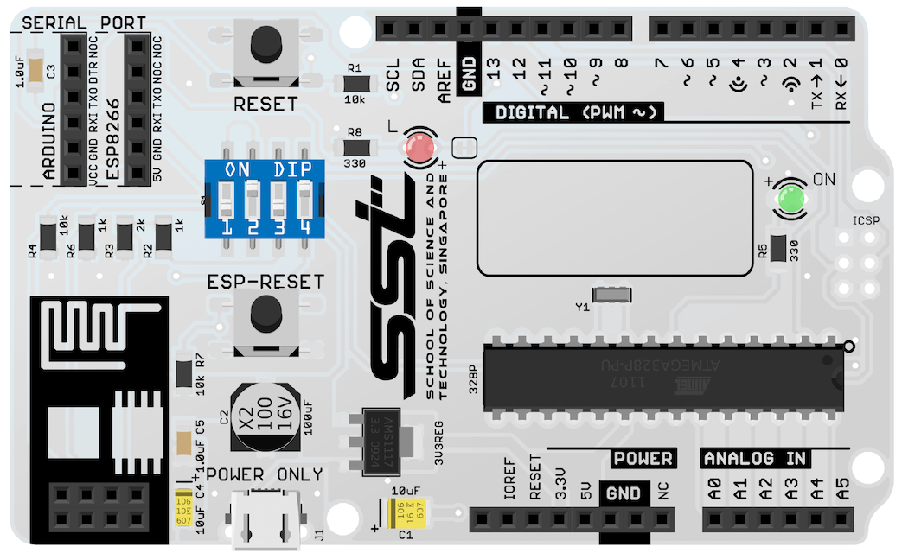

Designed by MakerFoundry LLP | Designed, assembled and tested in Singapore

# SSTuino
SSTuino is an easy to use Wi-Fi enabled microcontroller, designed and fabricated by SST Alumni. Users can write programs to connect or control things over the Internet. It is derived from the SPEEEduino 1.1 with some improvements.

Official Reference Website (original SPEEEduino): [https://sites.google.com/view/speeeduino/home](https://sites.google.com/view/speeeduino/home)

Related project: [ESPblaster](https://github.com/sammy0025/ESPblaster)

## Technical information

### Repository Layout
* **SSTuino**: EAGLE files for SSTuino
* **Image Assets**: Image assets for websites related to the SSTuino and markdown pages.

### Startup states table
This table controls the 

|  | GPIO0 (1) | GPIO2 (2) | ESP-RX connect to D4 (3) | ESP-TX connect to D2 (4) | ESP-RESET Button |
|---------|:---------:|:---------:|:---------|:|:---------|:|:---------|:|
| Wi-Fi Enable | ⬆️ | ⬆️ | ⬆️ | ⬆️ | Leave open |
| Disconnect ESP-01 | ❎ | ❎ | ⬇️ | ⬇️ | Leave open |
| Reset ESP-01 | ❎ | ❎ | ❎ | ❎ | Press down |
| Flash ESP-01 | ⬇️ | ⬆️ | ⬇️ | ⬇️ | Press down, set switches, release |

## Contributing
Contributing to the SSTuino Git Repository requires you to have EAGLE 8.4 or newer which supports Managed Libraries.

SSTuino primarily uses EAGLE's Managed Libraries made by Sparkfun, but also contain our own custom footprints and SMD component footprints from Cytron.

## Our team
* Project Supervisor: [Teo Shin Jen](https://www.youracclaim.com/user/sjteo)
* Chief Designer: Pan Ziyue ([@sammy0025](https://twitter.com/sammy0025))
* Assistants/Advisers: Julian Kang ([@Julian_KBK](https://twitter.com/Julian_KBK)), Goh Qian Zhe ([@QianZheGoh](https://twitter.com/QianZheGoh))
* Videographer: [@QianZheGoh](https://twitter.com/QianZheGoh)
* The awesome folks at Arduino, Sparkfun and Adafruit for technical reference and ECAD models.

Open Source Hardware (OSHW)
