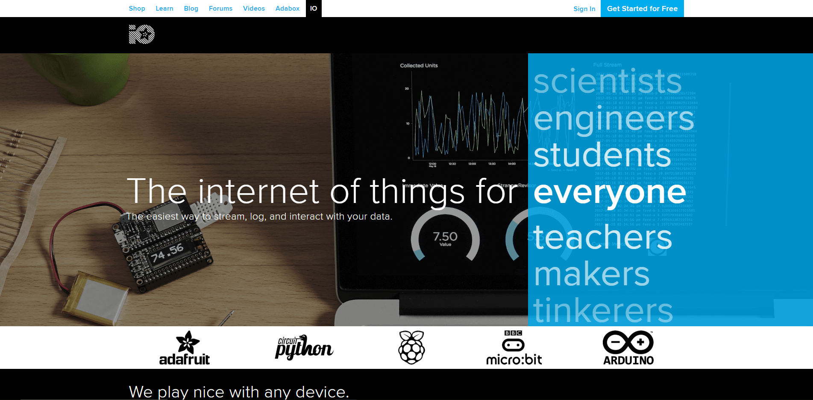
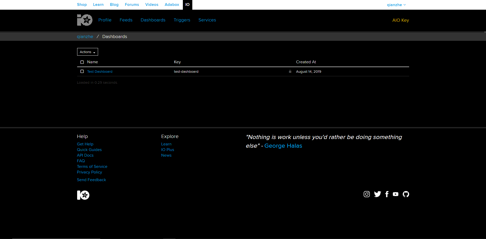

# Setting up Adafruit.io

This tutorial will talk about what Internet of Things is all about, and get you started with Adafruit.io.

## What is the Internet of Things (IoT) all about?

<iframe width="560" height="315" src="https://www.youtube.com/embed/BQzBpUdHvi4" frameborder="0" allow="accelerometer; autoplay; encrypted-media; gyroscope; picture-in-picture" allowfullscreen></iframe>

You may have seen weird things like smart fridges and smart toasters appear in a electronics store, but what is it really about? The term *Internet of Things* covers everything that is connected to the internet, but it is also increasingly used to define objects that communicate with each other. By connecting these devices together to an automated system, the system gathers information, analyses the information and creates an action to help with a certain task - for example a smart thermostat to help optimise the air conditioner operation in your room, saving on the amount of electricity used.

The Internet of Things industry is starting to get very popular in a lot of industries, and is also very popular with DIY makers who use microcontrollers such as the Arduino or the Raspberry Pi to automate lots of everyday stuff.

## Adafruit IoT

Welcome to Adafruit IoT:

<iframe width="560" height="315" src="https://www.youtube.com/embed/SiDYTLzV0yU" frameborder="0" allow="accelerometer; autoplay; encrypted-media; gyroscope; picture-in-picture" allowfullscreen></iframe>

First, let us go to the website: [https://io.adafruit.com/](https://io.adafruit.com/)

On the top right hand corner, click on **Get started for free**

Register an account for Adafruit.io. After you are done, your adafruit.io should look like this:

On the top tab you should be able to see:

* Feeds
* Dashboards
* Triggers
* Services

### Feeds

Feeds are the core of the Adafruit IoT system. It holds the data that you send to the system. One feed is used for one unique sensor data. For example, I have feed A for temperature and feed B for humidity.

Creating a Feed on Adafruit IO is a very simple process. When you login to your io.adafruit.com account, you will see a list of your current dashboards like the list shown below.

Click the Feeds link on the left hand side of the screen to navigate to the Feeds list.

Next, click on the Actions menu on the left hand side of the screen.

Next, click on the Create a New Feed menu item.

A form modal will launch, and you will be presented with two text inputs:

* Name - A short descriptive title of your data. Letters, numbers, and spaces are valid characters, and this field is required. The feed name must be unique for your account.
* Description - A long form description of your data. This field is not required, but it's useful to provide a detailed description if your feed will be public.

### Dashboard

<video style="width: 100%; height: auto" autoplay loop muted playsinline>
<source src="https://cdn-learn.adafruit.com/assets/assets/000/039/281/large1024mp4/adafruit_io_animation.mp4?1487025752" type="video/mp4">
Your browser does not support playing this video
</video>

Dashboards allow you to visualize data and control Adafruit IO connected projects from any modern web browser. Widgets such as charts, sliders, and buttons are available to help you quickly get your IoT project up and running without the need for any custom code.

Your list of dashboards will only have the Welcome Dashboard when it is first loaded. You can start the dashboard creation process by clicking the Actions menu on the upper left hand side of the screen.

Next, select **Create a New Dashboard** from the dropdown menu.

You can then enter the name and description of your new dashboard, and click the **Create button** once you are finished.

Once your dashboard has been created, click on the name of your new dashboard to load it.

You should now see your new blank dashboard.

Blocks are widgets that you can add to your dashboard. There are some blocks that can be used as outputs, and some that can be used as inputs. To add a new block, you can click the + (plus) button on the upper right hand side of the dashboard.

You will then be presented with a list of block types to choose from, like the one seen below.

## Connecting the SSTuino to Adafruit.io

In the next tutorial, we will upload temperature data from our SSTuino to Adafruit.io. **[SSTuino Adafruit.io example](https://d3lta-v.github.io/SSTuino/tutorials/Sec1/sstuinoIoT.html)**
