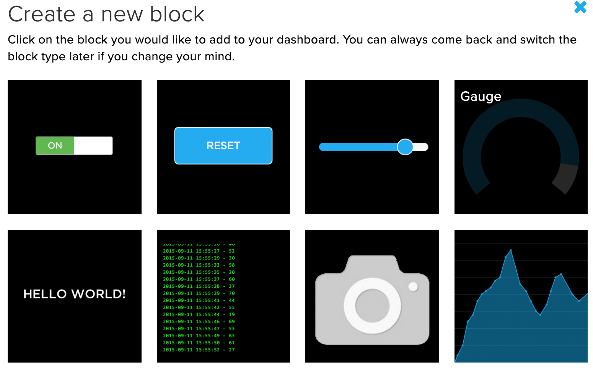

# The SSTuino can connect to the internet?!

This tutorial will cover the use of the WiFi functionality on the SSTuino board. We will be using it to interface it with a online IoT plaform - Adafruit IoT. Along with Thunkable, the IoT platofrm and the SSTuino, we can essentially create your own automated sensor suite or smart home project. The SSTuino is the main interface of the sensor/controllers, and collects all the sensor data and/or controlls all connected components like LEDs, fan etc.

This tutorial will require the use of the WiFi chip.

## Connecting SSTuino to Adafruit.io

First, we need to install a library to your Arduino IDE. Go to this Github repo: [https://github.com/d3lta-v/SSTuino_Companion](https://github.com/d3lta-v/SSTuino_Companion)

On the top right hand corner, click on Clone or Download, and click on **Download .zip**. **Please do not UNZIP the file after downloading**


Go to your Arduino IDE and click on:

> Sketch > Include Library > Add .zip library > select the .zip file you have just downloaded.

After which the library will be added.

### Hold your horses...

By having a fimware upgrade on the WiFi chip and having a new library for the SSTuino, we would like to bring something to light: MQTT. Watch this video to find out more!

<div class="embed-container">
<iframe width="560" height="315" src="https://www.youtube.com/embed/EIxdz-2rhLs" frameborder="0" allow="accelerometer; autoplay; encrypted-media; gyroscope; picture-in-picture" allowfullscreen></iframe>
</div>

Ok, back to the main topic...

## MQTT example

We are going to make your previous **[TMP36 Temperature Sensor](https://d3lta-v.github.io/SSTuino/tutorials/Sec1/dataInput.html#temperature-sensor)** smart and connect to the internet!

For our MQTT example, let us create a new feed:


In your Arduino IDE, go to

> File > Examples > SSTuino Companion > `Adafruit_MQTT_Pub`


The example should look something like this:


Now go to your Adafruit.io and get your API key and feed key.

Your API Key should look something like this:


Your Feed key should look someting like this: 


> **Important**: Please do not share API keys. Other users can use your account or flood data to it if your API key is public

Fill in your Wifi SSID (The name of the WiFi), password, Adafruit.io username, IO key and feed key in this section:
> Note that Enterprise WiFi networks such as `SST_Student` will not work on the WiFi Chip due to insufficient memory to use the more complicated protocol. Instead you would have to use your mobile hotspot. Note that hotspots with a Apostrophe `'` like `Qian Zhe's iPhone` will not work. Please change the name of the network. A good example is `SINGTEL-2001`


Remember this?


This is the code that we used:


Go to that particular example and download the code into your Arduino IDE. We are going to do some mix-and-match to make it work with Adafruit.io. Open your downloaded code in the Arduino IDE.

The code can be split into 3 parts. The red part is declaration, the green part is setup, and the blue part is the loop.


So the red declaration portion goes into this part of the MQTT example:


The green setup code goes into this part of the MQTT example:


The blue loop code goes into this part of the MQTT Example:


Your code should look something like this after the edit:

``` C++
/*
  Adafruit IO with MQTT
  For the SSTuino boards.
  This example sketch publishes to Adafruit IO every 7.5 seconds using MQTT.
  This can be a foundation to use for uploading sensor data to the cloud for
  an IoT sensor.
  This example code is in the public domain.
  https://d3lta-v.github.io/SSTuino/
*/

#include "SSTuino_Companion.h"

#define SSID          "SSID GOES HERE"
#define PASSWORD      "WIFI PASSWORD GOES HERE"
#define IO_USERNAME   "AIO USERNAME GOES HERE"
#define IO_KEY        "AIO KEY GOES HERE"
#define FEED_KEY      "FEED KEY GOES HERE"

SSTuino wifi = SSTuino();

int temp = 0;

void setup()
{
  Serial.begin(9600);

  // Open the link between the two devices
  wifi.openLink();

  // Verify that the link is ok between the two devices
  if (!wifi.smokeTest()) {
    Serial.println(F("Unable to establish link with Wi-Fi chip. Halting.")); 
    while (true){};
  }

  wifiConnect();

  setupMQTT();

  pinMode(A0, INPUT);
  Serial.begin(9600);
}

void loop()
{
  temp = (-40 + 0.488155 * (analogRead(A0) - 20) + 0);
  Serial.println(temp);

  transmitData(String(temp));
  delay(7500); // you can replace this delay with something longer or shorter,
               // but 7.5s interval is preferred to prevent flooding Adafruit IO
}

void wifiConnect(void)
{
  // Connects to Wifi and displays connection state
  wifi.connectToWifi(F(SSID), F(PASSWORD));
  Serial.println(F("Connecting to Wi-Fi..."));

  delay(10000); // 10 seconds optimal for wifi connection to fully establish

  Status wifiStatus = wifi.getWifiStatus();
  if (wifiStatus != SUCCESSFUL) {
    Serial.println(F("Failed to connect to Wi-Fi"));
    while (true){};
  } else {
    Serial.println(F("Wi-Fi connected"));
  }
}

void setupMQTT(void)
{
  // Setup MQTT
  Serial.println(F("Setting up MQTT..."));
  bool mqttSuccess = wifi.enableMQTT(F("io.adafruit.com"), true, IO_USERNAME, IO_KEY);
  if (!mqttSuccess) {
    Serial.println(F("Failed to enable MQTT. Halting."));
    while (true){};
  }
  delay(10000); // Wait for MQTT to fully connect

  // Check if MQTT is connected
  if (!wifi.isMQTTConnected()) {
    Serial.println(F("MQTT did not connect successfully!"));
    while (true){};
  } else {
    Serial.println(F("MQTT connected!"));
  }
}

void transmitData(const String& value)
{
  if (wifi.mqttPublish(F(IO_USERNAME "/feeds/" FEED_KEY), value)) {
    Serial.println(F("Successfully published data!"));
  } else {
    Serial.println(F("Failed to publish data!"));
  }
}
```

Let us now upload the code to the SSTuino. We will need the WiFi Chip (Flashed by Qian Zhe or Ziyue) to be installed on the SSTuino like this:
> Make sure that the small white switches are all ON (push upwards)


After the code has successfully uploaded, open up the serial monitor to verify that a link to Adafruit.io has been established. 


Go to your Adafruit.io temperature feed and you should be able to see data points come up in the feed.


Let us now create our new Adafruit.io dashboard. I'll name it `My Smart Home`, and place a gauge as follows:





After you have configured your dashboards, your guage will look like this!

