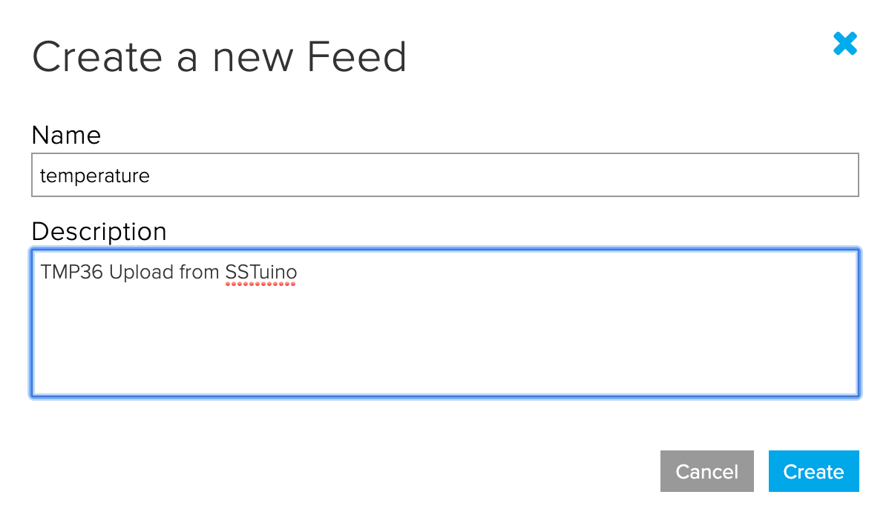
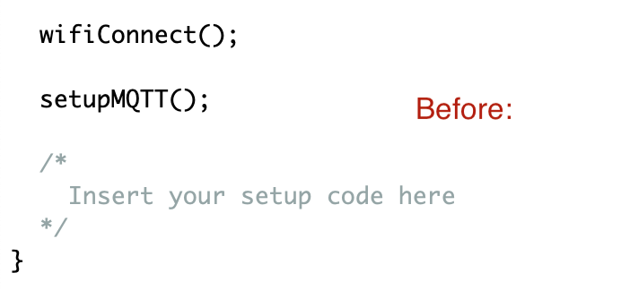

# The SSTuino can connect to the internet?!

This tutorial will cover the use of the WiFi functionality on the SSTuino board. We will be using it to interface it with a online IoT plaform - Adafruit IoT. Along with Thunkable, the IoT platofrm and the SSTuino, we can essentially create your own automated sensor suite or smart home project. The SSTuino is the main interface of the sensor/controllers, and collects all the sensor data and/or controlls all connected components like LEDs, fan etc.

This tutorial will require the use of the WiFi chip.

## Connecting SSTuino to Adafruit.io

First, we need to install a library to your Arduino IDE. Go to this Github repo: [https://github.com/d3lta-v/SSTuino_Companion](https://github.com/d3lta-v/SSTuino_Companion)

On the top right hand corner, click on Clone or Download, and click on **Download .zip**. **Please do not UNZIP the file after downloading**

Go to your Arduino IDE and click on:

> Sketch > Include Library > Add .zip library > select the .zip file you have just downloaded.

After which the library will be added.

### Hold your horses...

By having a fimware upgrade on the WiFi chip and having a new library for the SSTuino, we would like to bring something to light: MQTT. Watch this video to find out more!

<iframe width="560" height="315" src="https://www.youtube.com/embed/EIxdz-2rhLs" frameborder="0" allow="accelerometer; autoplay; encrypted-media; gyroscope; picture-in-picture" allowfullscreen></iframe>

Ok, back to the main topic...

## MQTT example

We are going to make your previous **[TMP36 Temperature Sensor](https://d3lta-v.github.io/SSTuino/tutorials/Sec1/dataInput.html#temperature-sensor)** smart and connect to the internet!

For our MQTT example, let us create a new feed:

In your Arduino IDE, go to

> File > Examples > SSTuino Companion > `Adafruit_MQTT_Pub`

The example should look something like this:

Now go to your Adafruit.io and get your API key and feed key.

Your API Key should look something like this:

Your Feed key should look someting like this: 

> **Important**: Please do not share API keys. Other users can use your account or flood data to it if your API key is public

Fill in these information below:

Remember this?

This is the code that we used:

Go to that particular example and download the code into your Arduino IDE. We are going to do some mix-and-match to make it work with Adafruit.io. Open your downloaded code in the Arduino IDE.

The code can be split into 3 parts. The red part is declaration, the green part is setup, and the blue part is the loop.

So the red declaration portion goes into this part of the MQTT example:

The green setup code goes into this part of the MQTT example:

The blue loop code goes into this part of the MQTT Example:

