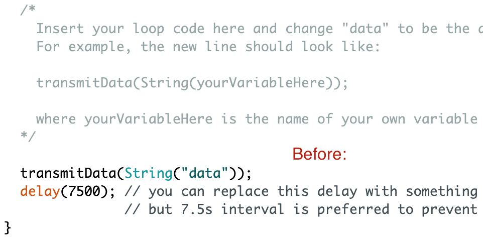
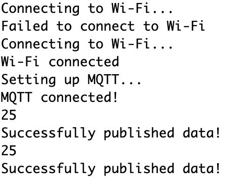
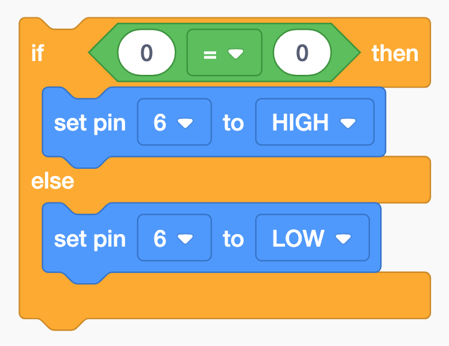
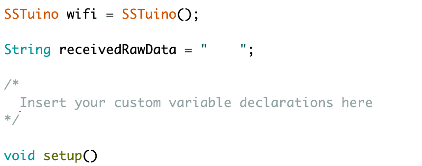

# The SSTuino can connect to the internet?!

This tutorial will cover the use of the WiFi functionality on the SSTuino board. We will be using it to interface it with a online IoT plaform - Adafruit IoT. Along with Thunkable, the IoT platofrm and the SSTuino, we can essentially create your own automated sensor suite or smart home project. The SSTuino is the main interface of the sensor/controllers, and collects all the sensor data and/or controlls all connected components like LEDs, fan etc.

This tutorial will require the use of the WiFi chip.

## Table of Contents
* [What is the Internet of Things (IoT) all about?](#what-is-the-internet-of-things-iot-all-about)
* [Creating your Adafruit.io account](#creating-your-adafruitio-account)
* [Connecting SSTuino to Adafruit.io](#connecting-sstuino-to-adafruitio)
* [MQTT Example](#mqtt-example)
* [Controlling your SSTuino!](#controlling-your-sstuino)
* [Connect SSTuino to Thunkable!](#connect-sstuino-to-thunkable)

## What is the Internet of Things (IoT) all about?

<div class="embed-container">
<iframe width="560" height="315" src="https://www.youtube.com/embed/BQzBpUdHvi4" frameborder="0" allow="accelerometer; autoplay; encrypted-media; gyroscope; picture-in-picture" allowfullscreen></iframe>
</div>

You may have seen weird things like smart fridges and smart toasters appear in a electronics store, but what is it really about? The term *Internet of Things* covers everything that is connected to the internet, but it is also increasingly used to define objects that communicate with each other. By connecting these devices together to an automated system, the system gathers information, analyses the information and creates an action to help with a certain task - for example a smart thermostat to help optimise the air conditioner operation in your room, saving on the amount of electricity used.


The Internet of Things industry is starting to get very popular in a lot of industries, and is also very popular with DIY makers who use microcontrollers such as the Arduino or the Raspberry Pi to automate lots of everyday stuff.

## Creating your Adafruit.io account

Welcome to Adafruit IoT:

<div class="embed-container">
<iframe width="560" height="315" src="https://www.youtube.com/embed/SiDYTLzV0yU" frameborder="0" allow="accelerometer; autoplay; encrypted-media; gyroscope; picture-in-picture" allowfullscreen></iframe>
</div>

To create your adafruit.io account go to this tutorial by Adafruit here:

**[https://learn.adafruit.com/welcome-to-adafruit-io/getting-started-with-adafruit-io](https://learn.adafruit.com/welcome-to-adafruit-io/getting-started-with-adafruit-io){:target="_blank"}**

## Connecting SSTuino to Adafruit.io

First, we need to install a library to your Arduino IDE. Simply copy and paste this command into your Terminal:

```sh
curl -fsSL https://sstuino.fourier.industries/library_install.sh | bash
```

...and hit enter! The installation should complete without any errors. You can always update your library by running the same command if there is a new release of the library available.

### Hold your horses...

By having custom made firmware and library for theSSTuino. we would like to bring something to light: MQTT. This **MQTT** Term will be used frequently in our internet of things tutorials for the SSTuino.

MQTT stands for **M**essage **Q**ueuing **T**elemetry **T**ransport. It is a lightweight publish and subscribe system where you can publish and receive messages as a client. 

MQTT is a simple messaging protocol, designed for constrained devices with low-bandwidth. So, it’s the perfect solution for Internet of Things applications. MQTT allows you to send commands to control outputs, read and publish data from sensor nodes and much more.

Therefore, it makes it really easy to establish a communication between multiple devices.

By having a fimware upgrade on the WiFi chip and having a new library for the SSTuino, we would like to bring something to light: MQTT. Watch this video to find out more!

<div class="embed-container">
<iframe width="560" height="315" src="https://www.youtube.com/embed/EIxdz-2rhLs" frameborder="0" allow="accelerometer; autoplay; encrypted-media; gyroscope; picture-in-picture" allowfullscreen></iframe>
</div>

Ok, back to the main topic...

## MQTT example

We are going to make your previous **[TMP36 Temperature Sensor](https://d3lta-v.github.io/SSTuino/tutorials/Sec1/dataInput.html#temperature-sensor)** smart and connect to the internet!

For our MQTT example, let us create a new feed:


In your Arduino IDE, go to

> File > Examples > SSTuino Companion > `Adafruit_MQTT_Pub`


The example should look something like this:


Remember this?


This is the code that we used:


Go to that particular example and open the code in TinkerCAD, in **Blocks + Text** mode. We are going to do some mix-and-match to make it work with Adafruit.io.


The code can be split into 3 parts. The red part is declaration, the green part is setup, and the blue part is the loop.


So the red declaration portion goes into this part of the MQTT example:

<p align="center">
  
   
</p>

The green setup code goes into this part of the MQTT example:

<p align="center">
  
   
</p>

The blue loop code goes into this part of the MQTT Example:

<p align="center">
  
   
</p>

Your code should look something like this after the edit:

``` Cpp
/*
  Adafruit IO with MQTT
  For the SSTuino boards.
  This example sketch publishes to Adafruit IO every 7.5 seconds using MQTT.
  This can be a foundation to use for uploading sensor data to the cloud for
  an IoT sensor.
  This example code is in the public domain.
  https://d3lta-v.github.io/SSTuino/
*/

#include "SSTuino_Companion.h"

#define SSID          "SSID GOES HERE"
#define PASSWORD      "WIFI PASSWORD GOES HERE"
#define IO_USERNAME   "AIO USERNAME GOES HERE"
#define IO_KEY        "AIO KEY GOES HERE"
#define FEED_KEY      "FEED KEY GOES HERE"

SSTuino wifi = SSTuino();

int temp = 0;

void setup()
{
  Serial.begin(9600);

  // Open the link between the two devices
  wifi.openLink();

  // Verify that the link is ok between the two devices
  if (!wifi.smokeTest()) {
    Serial.println(F("Unable to establish link with Wi-Fi chip. Halting.")); 
    while (true){};
  }

  wifiConnect();

  setupMQTT();

  pinMode(A0, INPUT);
  Serial.begin(9600);
}

void loop()
{
  temp = (-40 + 0.488155 * (analogRead(A0) - 20) + 0);
  Serial.println(temp);

  transmitData(String(temp));
  delay(7500); // you can replace this delay with something longer or shorter,
               // but 7.5s interval is preferred to prevent flooding Adafruit IO
}

void wifiConnect(void)
{
  // Connects to Wifi and displays connection state
  wifi.connectToWifi(F(SSID), F(PASSWORD));
  Serial.println(F("Connecting to Wi-Fi..."));

  delay(10000); // 10 seconds optimal for wifi connection to fully establish

  Status wifiStatus = wifi.getWifiStatus();
  if (wifiStatus != SUCCESSFUL) {
    Serial.println(F("Failed to connect to Wi-Fi"));
    while (true){};
  } else {
    Serial.println(F("Wi-Fi connected"));
  }
}

void setupMQTT(void)
{
  // Setup MQTT
  Serial.println(F("Setting up MQTT..."));
  bool mqttSuccess = wifi.enableMQTT(F("io.adafruit.com"), true, IO_USERNAME, IO_KEY);
  if (!mqttSuccess) {
    Serial.println(F("Failed to enable MQTT. Halting."));
    while (true){};
  }
  delay(10000); // Wait for MQTT to fully connect

  // Check if MQTT is connected
  if (!wifi.isMQTTConnected()) {
    Serial.println(F("MQTT did not connect successfully!"));
    while (true){};
  } else {
    Serial.println(F("MQTT connected!"));
  }
}

void transmitData(const String& value)
{
  if (wifi.mqttPublish(F(IO_USERNAME "/feeds/" FEED_KEY), value)) {
    Serial.println(F("Successfully published data!"));
  } else {
    Serial.println(F("Failed to publish data!"));
  }
}
```


Now go to your Adafruit.io and get your API key and feed key.

Your API Key should look something like this:


Your Feed key should look someting like this: 


> **Important**: Please do not share API keys. Other users can use your account or flood data to it if your API key is public

Fill in your Wifi SSID (The name of the WiFi), password, Adafruit.io username, IO key and feed key in this section:
> Note that Enterprise WiFi networks such as `SST_Student` will not work on the WiFi Chip due to insufficient memory to use the more complicated protocol. Instead you would have to use your mobile hotspot. Note that hotspots with a Apostrophe `'` like `Qian Zhe's iPhone` will not work. Please change the name of the network. A good example is `SINGTEL-2001`


Let us now upload the code to the SSTuino. We will need the WiFi Chip (Flashed by Qian Zhe or Ziyue) to be installed on the SSTuino like this:
> Make sure that the small white switches are all ON (push upwards)


After the code has successfully uploaded, open up the serial monitor to verify that a link to Adafruit.io has been established. 



Go to your Adafruit.io temperature feed and you should be able to see data points come up in the feed.


Let us now create our new Adafruit.io dashboard. I'll name it `My Smart Home`, and place a gauge as follows:


After you have configured your dashboards, your guage will look like this!


## Controlling your SSTuino!

Since we have managed to send temperature data from the SSTuino to Adafruit.io, now let us try controlling something on the SSTuino from Adafruit.io!

First, let us create a new feed in Adafruit.io. Name it `trigger`. We are going to use another example this time, the MQTT Subscribe example. In the example, the SSTuino will wait on commands from the Adafruit.io platform.


Next go to your dashboards, and use the previous dashboard: **My Smart Home**. In the dashboard we will place in a switch, which is configured to change the `trigger` feed we had created just now.

<p align="center">
  
   
</p>


Next we will place in a feed, which is configured to read the `trigger` feed we had created just now.

First, let us create a new circuit in TinkerCAD. We will connect our LED to `PIN6`, as shown:


Our code will look something like this:

{: .small-image-left }

After the creation of your new circuit, open the example `Adafruit_IO_MQTT_Sub`


Just like the TMP36 example, we will need to combine the code from TinkerCAD into our examples, just that this time there will be a little twist...

Once the example is open, it will look something like this:


From our TinkerCAD, open up **Blocks + Text**.


We are now going to integrate this code from TinkerCAD to our MQTT Subscribe example. It is very simillar to our previous TMP 36 example. As there are no declarations in this code, just leave the comment alone.

{: .medium-image-left }

We will now copy the setup code into the program. Remember to only copy the contents inside the brackets.

<p align="center">
  
   
</p>

Let us now insert the Void loop code into the program. Remember to only copy the contents inside the brackets.

<p align="center">
  
   
</p>

We will now need to do some editing to the loop code. When you look at the loop code, you would probably realise that the `if (0 == 0)` is not correct and not logical. This is because that we will be comparing a string, which is not possible in TinkerCAD.

>A string is a data type used in programming, such as an integer and floating point unit, but is used to represent text rather than numbers. Find out more here: 
<div class="embed-container">
<iframe width="560" height="315" src="https://www.youtube.com/embed/3A3TFVDrLCA" frameborder="0" allow="accelerometer; autoplay; encrypted-media; gyroscope; picture-in-picture" allowfullscreen></iframe></div>

Let us have a look at the line above the loop code that we pasted in just now. It looks something like this: `Serial.println(receivedRawData)`. The variable `receivedRawData` is a **String** and it is the data sent from the Adafruit IO platform. 

From your Adafruit IO, you would have seen that if the switch is **ON**, the readout from the feed will also be **ON**. so what we will do is that we will change the `if (0 == 0)` to `if (receivedRawData == "ON")`. This means that when I receive a message from Adafruit.io for ON, I will turn on the LED. Else, I will turn off the LED. Your edited loop code should look something like this:

{: .small-image-left }

Here is the text code you have just done:

```Cpp
/*
  Adafruit IO with MQTT

  For the SSTuino boards.

  This example sketch subscribes to Adafruit OP using MQTT.
  This can be a foundation to use for automation over the Internet.

  This example code is in the public domain.

  https://d3lta-v.github.io/SSTuino/
*/

#include "SSTuino_Companion.h"

#define SSID          "SSID GOES HERE"
#define PASSWORD      "WIFI PASSWORD GOES HERE"
#define IO_USERNAME   "AIO USERNAME GOES HERE"
#define IO_KEY        "AIO KEY GOES HERE"
#define FEED_KEY      "FEED KEY GOES HERE"

SSTuino wifi = SSTuino();

String receivedRawData = "    ";

/*    
  Insert your custom variable declarations here
*/

void setup()
{
  Serial.begin(9600);

  // Open the link between the two devices
  wifi.openLink();

  // Verify that the link is ok between the two devices
  if (!wifi.smokeTest()) {
    Serial.println(F("Unable to establish link with Wi-Fi chip. Halting.")); 
    while (true){};
  }

  wifiConnect();

  setupMQTT();

  pinMode(6, OUTPUT);
  
}

void loop()
{
  bool newDataReceived = false;
  wifi.mqttPollNewData(&newDataReceived, F(IO_USERNAME "/feeds/" FEED_KEY), 500);
  /* The above code "mutates" the newDataReceived variable, which means it
     doesn't have to return anything */

  if (newDataReceived == true) {
    // Print out the new data when you received it
    receivedRawData = wifi.mqttGetSubcriptionData(F(IO_USERNAME "/feeds/" FEED_KEY));
    Serial.print(F("New data received: "));
    Serial.println(receivedRawData);
  }

  if (receivedRawData == "ON") {
    digitalWrite(6, HIGH);
  } else {
    digitalWrite(6, LOW);
  }
}

void wifiConnect(void)
{
  // Connects to Wifi and displays connection state
  wifi.connectToWifi(F(SSID), F(PASSWORD));
  Serial.println(F("Connecting to Wi-Fi..."));

  delay(10000); // 10 seconds optimal for wifi connection to fully establish

  Status wifiStatus = wifi.getWifiStatus();
  if (wifiStatus != SUCCESSFUL) {
    Serial.println(F("Failed to connect to Wi-Fi"));
    while (true){};
  } else {
    Serial.println(F("Wi-Fi connected"));
  }
}

void setupMQTT(void)
{
  // Setup MQTT
  Serial.println(F("Setting up MQTT..."));
  bool mqttSuccess = wifi.enableMQTT(F("io.adafruit.com"), true, IO_USERNAME, IO_KEY);
  if (!mqttSuccess) {
    Serial.println(F("Failed to enable MQTT. Halting."));
    while (true){};
  }
  delay(10000); // Wait for MQTT to fully connect

  // Check if MQTT is connected
  if (!wifi.isMQTTConnected()) {
    Serial.println(F("MQTT did not connect successfully!"));
    while (true){};
  } else {
    Serial.println(F("MQTT connected!"));
  }

  // Setup MQTT subscribe
  if (wifi.mqttSubscribe(F(IO_USERNAME "/feeds/" FEED_KEY))) {
    Serial.println(F("Successfully subscribed!"));
  } else {
    Serial.println(F("Failed to subscribe. Halting."));
    while (true){};
  }
}
```

Now let us add a slider onto the dashboard. The values should range from 0 - 255.


Let us remove this portion of code from the program

```C++
  if (receivedRawData == "ON") {
    digitalWrite(6, HIGH);
  } else {
    digitalWrite(6, LOW);
  }
```

Instead, replace it with this

``` C++
  analogWrite(6, receivedRawData.toInt())
```

You may have seen something unfamillar. The `toInt()` function converts the value of the string `recievedRawData` into an integer (Whole number) for the pwm to be able to output.

After you have edited the code, simply upload it to the SSTuino, wait for the MQTT to subscribe and there you go!

## Connect SSTuino to Thunkable!

Now we have managed to control your SSTuino from Adafruit.io, let us use our Thunkable to view our SSTuino statistics and to control our SSTuino!

For this portion of the tutorial, we managed to do up a Thunkable template for you! Simply go to this link here:

**[https://x.thunkable.com/copy/678d79fc0c561ef77e5e6a4fcbd5788e](https://x.thunkable.com/copy/678d79fc0c561ef77e5e6a4fcbd5788e)**

You will just need your AIO username, AIO Key and feed key to get started!


