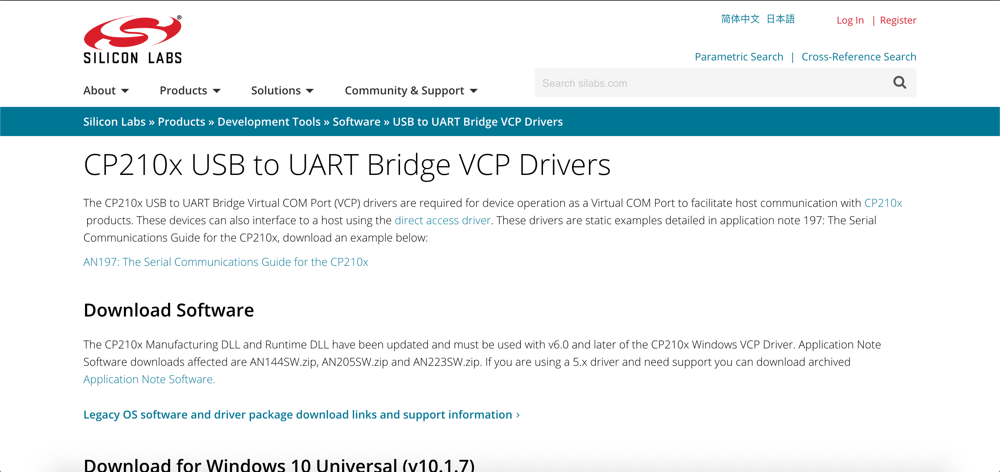
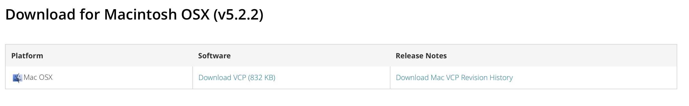

# Getting started with the SSTuino

SSTuino is an easy to use Wi-Fi enabled microcontroller, designed and fabricated by SST Alumni. Users can write programs to connect or control things over the Internet. It is derived from the SPEEEduino 1.1 with some improvements.

This tutorial is a simple guide on how to get started with the SSTuino.

> Note: This article was last updated on 25th October 2019.


## Setting up...

**Note**: Please take your time and carefully go through this tutorial as it is the most crucial step to get your product working. It is also recommended to set this up before the SSTuino lessons starts with your parents to allow the smoothest possible experience. Learning devices with **parental control** will need to have their parents approve the driver installation.

Here are a list of things you require to go through this tutorial.

1. Your learning device
2. An active internet connection
3. The SSTuino Innovator's Kit

## Installation of the CP2102 Driver

We are using the NEU (New Enhanced UART) for our SSTuino. It is our custom made CP2102 USB to serial converter for the computer to "talk" to the SSTuino. To use the NEU with the MacOS, a firmware is reqruied to be installed.

### Installation for MacOS



For MacOS users, the Silicon Labs driver has to be manually downloaded and installed. The driver can be downloaded here: [https://www.silabs.com/products/development-tools/software/usb-to-uart-bridge-vcp-drivers](https://www.silabs.com/products/development-tools/software/usb-to-uart-bridge-vcp-drivers)



Navigate to this area and download the driver. After the driver has been downloaded, launch the `SiLabsUSBDriverDisk.dmg` located inside the folder you have downloaded. You will need to run the `Install CP210x VCP Driver` app, as demonstrated below: 


Follow the instructions from the installation app. Note that you will be prompted to enter your password.


## Installation of the Arduino IDE


- Go to the the downloads page here: [https://www.arduino.cc/en/Main/Software](https://www.arduino.cc/en/Main/Software)
- Download the version of the application you require.
    - For MacOS users download the Mac OS X version 10.8 Mountain Lion and newer. For MacOS Catalina users, please download the newest version available, as versions before 1.8.10 will not work with MacOS Catalina.

After download of the zip file from the Arduino website, simply copy the .app file into your **Applications** folder. 

>Note: Make sure you copy the app to your **Applications** folder for elevated admistrative rights. Those learning devices with parental controls will have a password prompt for administrative access.


In any event the system asks you whether to open the app, just click open.

### Installation of the SSTuino Companion Library

We have some additional examples that are specially catered for the SSTuino. 

First, we need to install a library to your Arduino IDE. Simply copy and paste this command into your Terminal:

```sh
curl -fsSL https://sstuino.fourier.industries/library_install.sh | bash
```

...and hit enter! The installation should complete without any errors. You can always update your library by running the same command if there is a new release of the library available.

## Ready to roll?

After these two important things are installed, you should be pretty much ready for our further tutorials! If you are ready, proceed on to the next tutorial: [Hello World!](helloWorld.md)