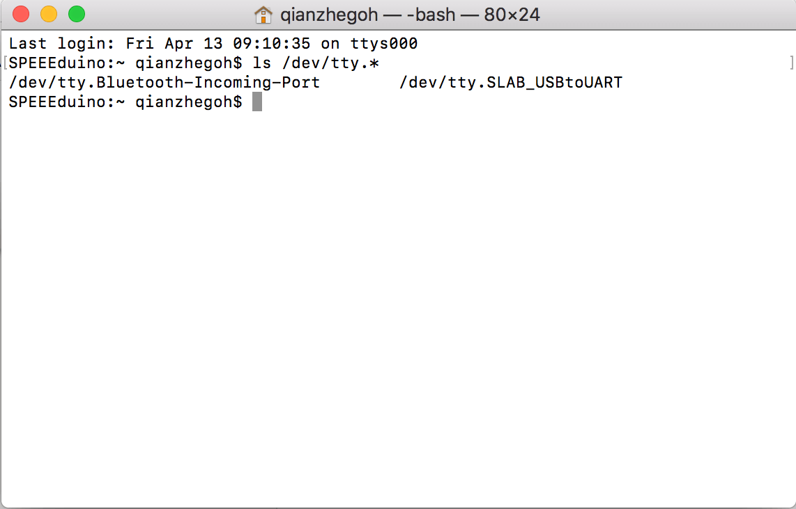
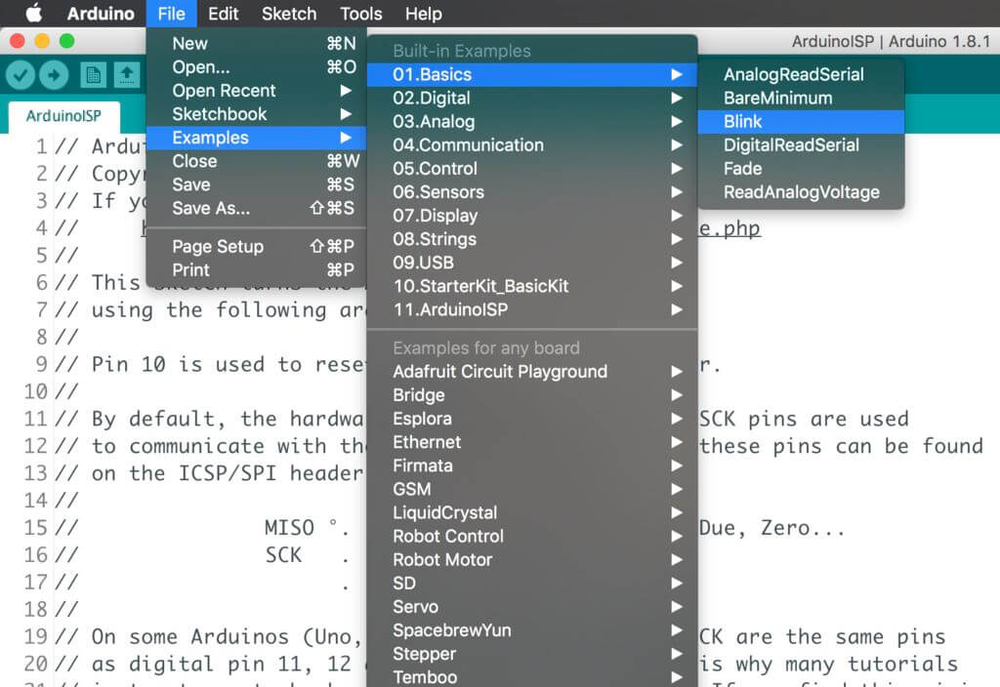
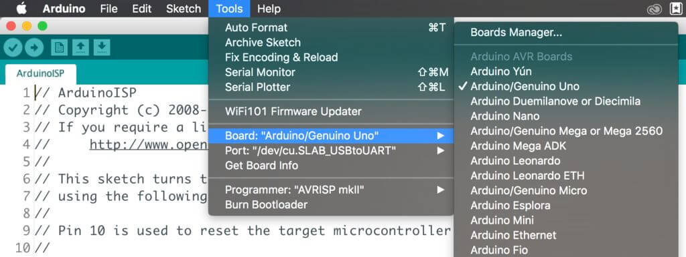
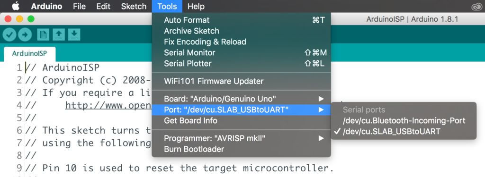

# Hello, World!

So, you have just completed the setup of your computer and familarised yourself with the SSTuino Kit. What would be the next step?

**Before you begin**

Do not plug anything wrongly or [expensive failures](https://youtu.be/WFZwI10HEsw?t=591) may happen...

## Connecting up your SSTuino

1. Insert the CP2102 and WiFi Chip as shown.

2. Plug in the cable to the CP2102 and your computer (mac).
3. Watch it light up!

## Preflight Checks...

We first check if the USB to serial converter is detected by System Information. If it is detected, it would look something like this:


Nice name right?

We first check if the USB to serial converter can be detected. To do so, launch the Terminal app from your mac and type in this line:

`ls /dev/tty.*`

and press *enter/return.*



You should see the device called `/dev/tty.SLAB_USBtoUART` appear.

## Almost there!

You are almost ready to launch! But first, open the Arduino app you downloaded from [this tutorial](https://d3lta-v.github.io/SSTuino/tutorials/gettingStarted.html).



Once the app is open, go to:

`File -> Examples -> 01. Basics -> Blink`

Blink is a very simple example code included in the Arduino IDE. Due to the resemblance of the SSTuino with the Arduino (especially the Uno), any code that can be used with the Arduino Uno can be used with the SSTuino, with the exception that the SSTuino has a WiFi module attached. It is normally also the example code I use to check if the device is working.



Before uploading the example code, make sure that you have selected the Arduino Uno as the device. 



Also, please make sure that you have the correct port as shown above. Since this board is designed for SST, and used in the MacOS environment, the port that appears should be the same as shown in the picture above.

Now you can upload your code and you should see your onboard LED blinking! Have fun!

## But wait, there's more!

How about I change how the LED blinks?


In the circled section you can see a few lines of code.

```C++
void loop() {
  digitalWrite(LED_BUILTIN, HIGH);   // turn the LED on (HIGH is the voltage level)
  delay(1000);                       // wait for a second
  digitalWrite(LED_BUILTIN, LOW);    // turn the LED off by making the voltage LOW
  delay(1000);                       // wait for a second
}
```
So what did the `HIGH` and `LOW` mean? Digital electronics only have 2 states. Think of it as a switch. When it is `HIGH` it means that it is turned **on**. When it is `LOW`, it is turned **off**.

The `delay(1000);` tells the microcontroller to wait for a second. This means that this entire section of code tells the LED to turn on for 1 second and then turn off for 1 second!

 The `1000` is in miliseconds, and you can change that value, before uploading the code again! Bear in mind that if you have too small or too large of a number, you would either not see the LED not doing anything, or takes ages to do something.

*So, have fun and enjoy the tutorials that lie ahead!*